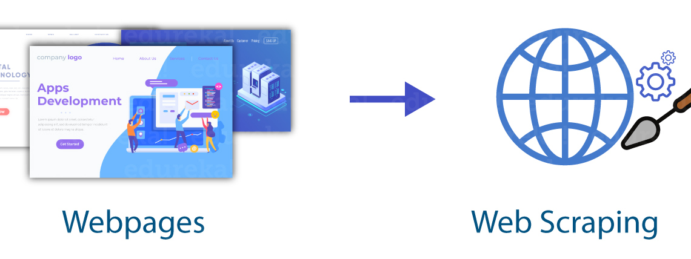
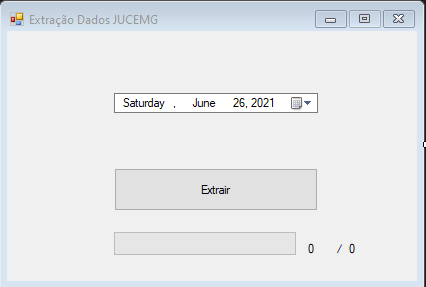

  
  
  
  

  

 
  
     
    
     
       

 <a href="#eye_speech_bubble-visualizar">Visualizar</a> •
 <a href="#information_source-sobre">Sobre</a> • 
 <a href="#hammer_and_wrench-tecnologias">Tecnologias</a> • 
 <a href="#brain-conceitos-aplicados">Conceitos</a> • 
 <a href="#boy-autor">Autor</a> •
 <a href="#balance_scale-licença">Licença</a>

---

## :eye_speech_bubble: **Visualizar**

|                            :computer:                             |
| :---------------------------------------------------------------: |
| <kbd></kbd> |

  
---

## :information_source: Sobre

Aplicação criada para realizar a automatização da extração de dados públicos da página da JUCEMG MG

---

## :hammer_and_wrench: **Tecnologias**

|                                               :globe_with_meridians:                                                |
| :-----------------------------------------------------------------------------------------------------------------: |
|                                  [PuppeteerSharp](https://www.puppeteersharp.com/)                                  |
| [Windows Forms](https://docs.microsoft.com/en-us/visualstudio/ide/create-csharp-winform-visual-studio?view=vs-2019) |
|        [C#](https://docs.microsoft.com/en-us/visualstudio/get-started/csharp/visual-studio-ide?view=vs-2019)        |
|                      [JavaScript ES6](https://developer.mozilla.org/en-US/docs/Web/JavaScript)                      |

---

## :brain: **Conceitos Aplicados**

|                                                                         :page_facing_up:                                                                         |
| :--------------------------------------------------------------------------------------------------------------------------------------------------------------: |
|                           [Asynchronous Programming](https://docs.microsoft.com/en-us/dotnet/csharp/programming-guide/concepts/async/)                           |
|                                     [Delegates](https://docs.microsoft.com/en-us/dotnet/csharp/programming-guide/delegates/)                                     |
|                             [MultiThreading](https://docs.microsoft.com/en-us/dotnet/standard/threading/using-threads-and-threading)                             |
| [DOM Manipulation](https://developer.mozilla.org/en-US/docs/Learn/JavaScript/Client-side_web_APIs/Manipulating_documents#active_learning_basic_dom_manipulation) |
|                                                  [XPath Syntax](https://www.w3schools.com/xml/xpath_syntax.asp)                                                  |

---

## :boy: **Autor**

<a href="https://github.com/gleisonkz">
 
  
 <b>Gleison de Almeida</b>
</a>

Desenvolvido com ❤️ por Gleison Almeida 👋🏽 Meus Contatos!

---

## :balance_scale: **Licença**

Copyright © 2021 [Gleison Almeida](https://github.com/gleisonkz). 
This project is licensed by [MIT](./LICENSE).

